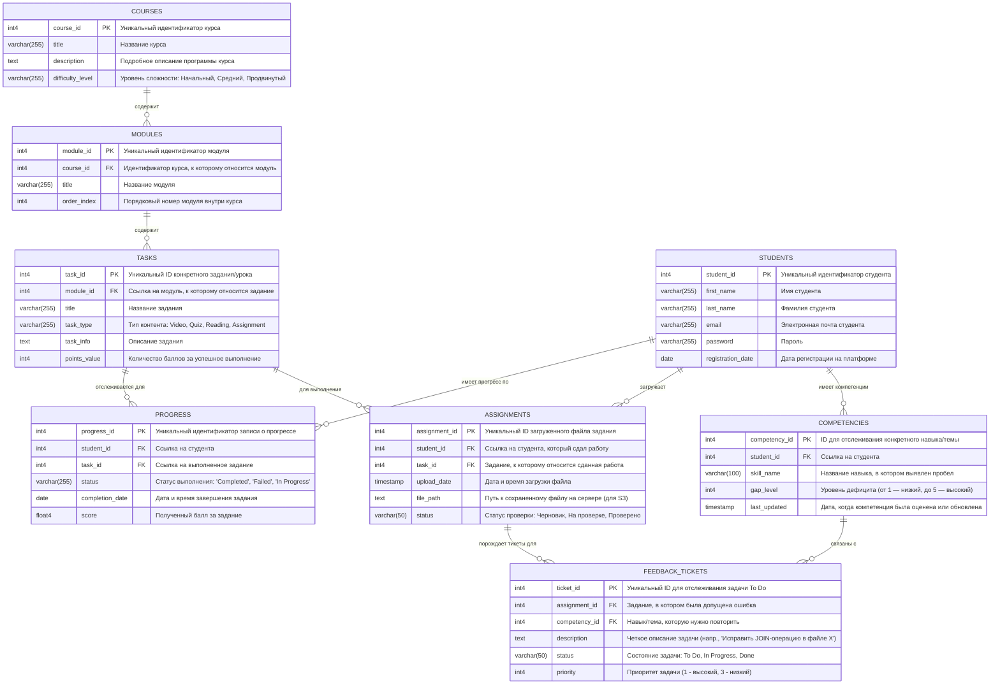

## Схема базы данных

```mermaid
erDiagram
    COURSES ||--o{ MODULES : "содержит"
    MODULES ||--o{ TASKS : "содержит"
    STUDENTS ||--o{ PROGRESS : "имеет прогресс по"
    STUDENTS ||--o{ ASSIGNMENTS : "загружает"
    TASKS ||--o{ PROGRESS : "отслеживается для"
    TASKS ||--o{ ASSIGNMENTS : "для выполнения"
    ASSIGNMENTS ||--o{ FEEDBACK_TICKETS : "порождает тикеты для"
    STUDENTS ||--o{ COMPETENCIES : "имеет компетенции"
    COMPETENCIES ||--o{ FEEDBACK_TICKETS : "связаны с"

    COURSES {
        int4 course_id PK "Уникальный идентификатор курса"
        varchar(255) title "Название курса"
        text description "Подробное описание программы курса"
        varchar(255) difficulty_level "Уровень сложности: Начальный, Средний, Продвинутый"
    }

    MODULES {
        int4 module_id PK "Уникальный идентификатор модуля"
        int4 course_id FK "Идентификатор курса, к которому относится модуль"
        varchar(255) title "Название модуля"
        int4 order_index "Порядковый номер модуля внутри курса"
    }

    TASKS {
        int4 task_id PK "Уникальный ID конкретного задания/урока"
        int4 module_id FK "Ссылка на модуль, к которому относится задание"
        varchar(255) title "Название задания"
        varchar(255) task_type "Тип контента: Video, Quiz, Reading, Assignment"
        text task_info "Описание задания"
        int4 points_value "Количество баллов за успешное выполнение"
    }

    STUDENTS {
        int4 student_id PK "Уникальный идентификатор студента"
        varchar(255) first_name "Имя студента"
        varchar(255) last_name "Фамилия студента"
        varchar(255) email "Электронная почта студента"
        varchar(255) password "Пароль"
        date registration_date "Дата регистрации на платформе"
    }

    PROGRESS {
        int4 progress_id PK "Уникальный идентификатор записи о прогрессе"
        int4 student_id FK "Ссылка на студента"
        int4 task_id FK "Ссылка на выполненное задание"
        varchar(255) status "Статус выполнения: 'Completed', 'Failed', 'In Progress'"
        date completion_date "Дата и время завершения задания"
        float4 score "Полученный балл за задание"
    }

    ASSIGNMENTS {
        int4 assignment_id PK "Уникальный ID загруженного файла задания"
        int4 student_id FK "Ссылка на студента, который сдал работу"
        int4 task_id FK "Задание, к которому относится сданная работа"
        timestamp upload_date "Дата и время загрузки файла"
        text file_path "Путь к сохраненному файлу на сервере (для S3)"
        varchar(50) status "Статус проверки: Черновик, На проверке, Проверено"
    }

    COMPETENCIES {
        int4 competency_id PK "ID для отслеживания конкретного навыка/темы"
        int4 student_id FK "Ссылка на студента"
        varchar(100) skill_name "Название навыка, в котором выявлен пробел"
        int4 gap_level "Уровень дефицита (от 1 — низкий, до 5 — высокий)"
        timestamp last_updated "Дата, когда компетенция была оценена или обновлена"
    }

    FEEDBACK_TICKETS {
        int4 ticket_id PK "Уникальный ID для отслеживания задачи To Do"
        int4 assignment_id FK "Задание, в котором была допущена ошибка"
        int4 competency_id FK "Навык/тема, которую нужно повторить"
        text description "Четкое описание задачи (напр., 'Исправить JOIN-операцию в файле X')"
        varchar(50) status "Состояние задачи: To Do, In Progress, Done"
        int4 priority "Приоритет задачи (1 - высокий, 3 - низкий)"
    }
```