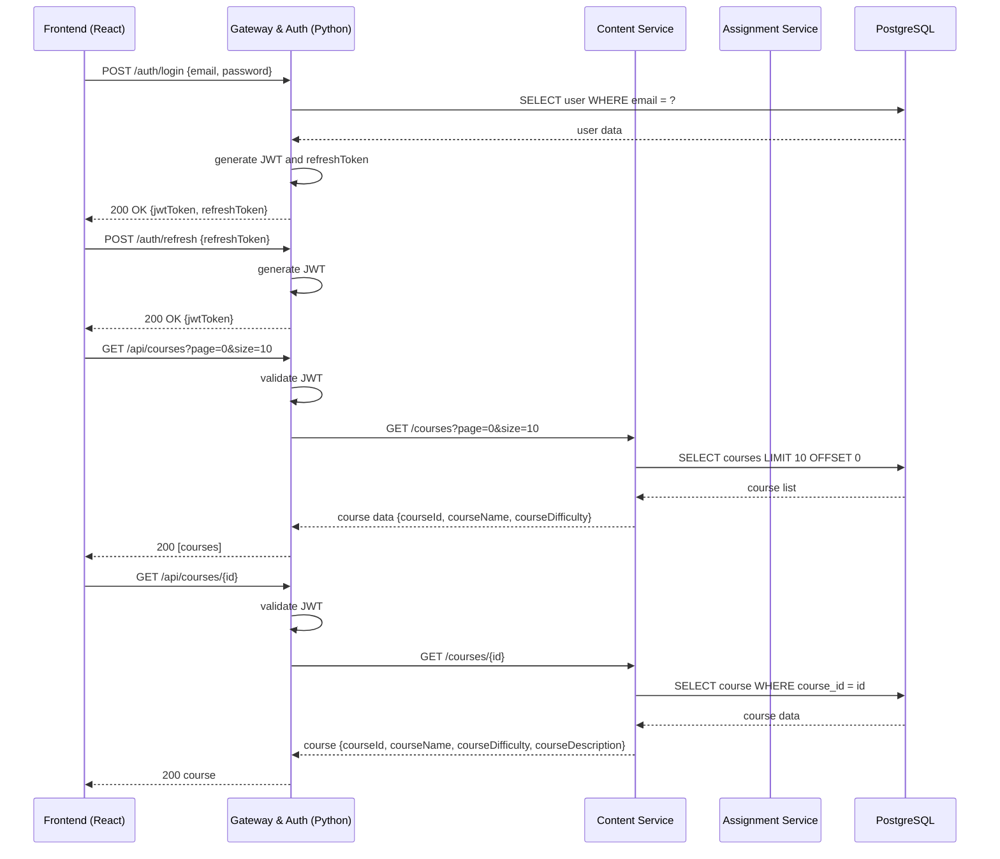

##  Пользовательский сценарий: Трек «Студент»

Решение реализует полный путь студента в соответствии с ТЗ:
- просмотр учебных материалов,
- загрузка домашнего задания (до 100 МБ),
- получение комментария и оценки от преподавателя.

### Последовательность взаимодействия компонентов

